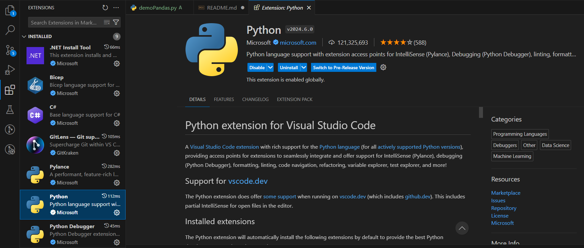
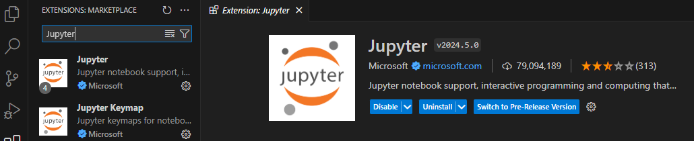

# AI Academy Globant 101

This repository will act as the central codebase for the exercises that will be use during the **AI Academy**.

The idea is to provided students the basic starting points to start on the AI Revolution and get familiar with the different aspects that under the AI univers like: Machine Learning, Computer Vision, Generative AI, etc... You can find more information about this initiative on the **AI HUB Monterrey** [site](https://sites.google.com/globant.com/ai-hub-monterrey/proyectos/ai-academy).

We will cover those topics on a high level without going to deep on those areas. The idea of the phase of the Academy is to establish the base line. We wil explore each subject in deep and detail in subsequent phases (TBD).

## Prerequisites 

1. Install Visual Studio Code: https://code.visualstudio.com/download
2. Install Python: https://www.python.org/downloads/
3. Install pip: https://packaging.python.org/en/latest/tutorials/installing-packages/
4. Install Python plugin on VS code

5. Install Jupyter extension:

6. ***IMPORTANT**. Acceso a GitHub
   - AI Academy repo: https://github.com/mike-peraza/AI_Academy_Globant_MTY
   - If you don't have access to the Globant Github, you will need to create a ticket for it on [Jira Service Management](https://globant-services.atlassian.net/servicedesk/customer/portals).

## Content
- Module 0: Fundamentals of Python Programing
- Module 1: Machine Learning
- Module 2: Deep Learning for Computer Vision
- Module 3: Natural Language Processing (NLP)
- Module 4: Transformers and Large Language Models (LLM)
- Module 5: Generative AI

## AI HUB Website

If you want to explore more AI initiatives from the AI Hub Monterrey, you can visit the following [site](https://sites.google.com/globant.com/ai-hub-monterrey/inicio)